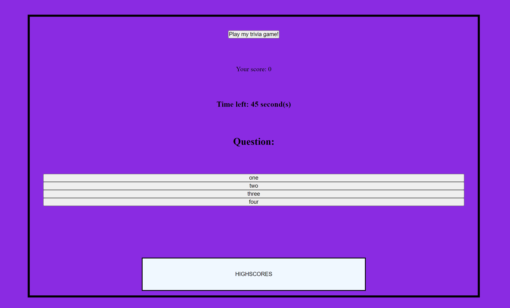

# trivia-project
Description:

This repo contains a trivia game. There are currently 10 questions, however more questions can be added by adding to the array of objects in script.js.

Upon clicking the start button, the first question is displayed and the timer starts. Score is also tracked (10 points per correct answer) and time is taken off the clock for every wrong answer.

When the timer reaches 0, the user is prompted for their initials. Their score is then saved to the local storage and displayed on the "Highscore" screen.

Installation: N/A

Usage: N/A

Credits: Nathan Alexander

License: Please refer to the license in the repo

Badges: N/A

Features: Buttons to start quiz and view highscores. Local storage to store score.

How to Contribute: N/A

Tests: N/A

Screenshot:

Deployment Link:
https://nathanalexander1.github.io/trivia-project/